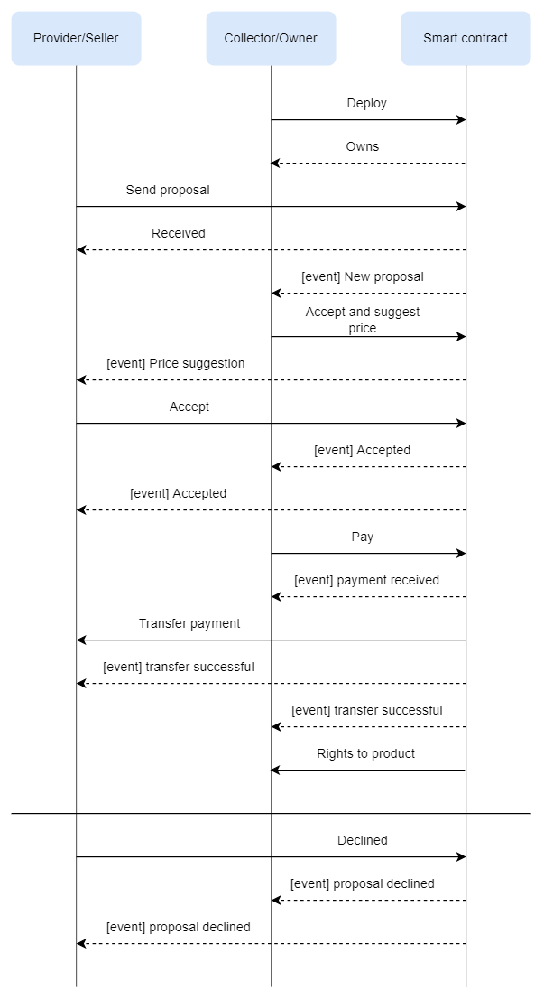

# Smart contract
Blockchain 4-oji užduotis. Išmanioji sutartis aprašo iliustracijas, nuotraukas ar pan. supirkinėjančio/kolekcionuojančio asmens ar įmonės veiklą.
## Išmaniosios sutarties verslo logika

Verslo procese dalyvauja:
* Pardavėjas/teikėjas (seller/provider) - jis siūlo įsigyti savo nuotraukas;
* Supirkėjas/kolekcionuotojas (collector) - jis deploy'ina kontraktą ir gauną pasiūlymus iš pardavėjų.

Gavęs pasiūlimą supirkėjas nustato jo vertę ir pasiūlo kainą. Jei ši kaina tenkina pardavėją, jis patvirtina pasiūlymą ir laukia užmokesčio. Supirkėjas, sumokėjęs už nuotrauką, gauna jos teises ir pilną jos failą (pagal idėją, supirkėjas nesumokęs gali tik matyti nuotraukos *preview* ir šios nuotraukos duomenis (size, resolution, etc.)).